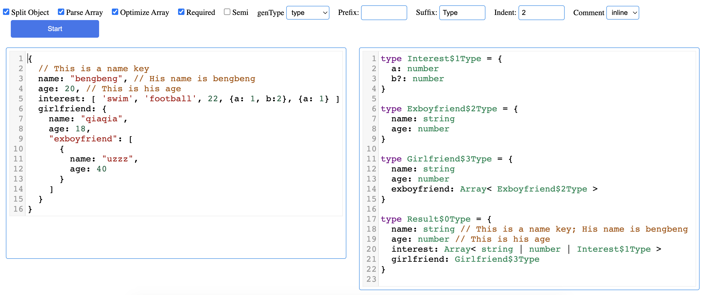

<p align="center">

</p>

<h1 align="center">
Json2ts
</h1>
<p align="center">
Convert JSON to ts type by compiler
<p>

English | [中文](./README.CN.md)

`json-parse > transform > codegen`

[online link](https://patrickchen928.github.io/json2ts/index.html)



## vscode plugin

[plugin](https://marketplace.visualstudio.com/items?itemName=cyly.json2ts-vsc&ssr=false#overview)

[github](https://github.com/PatrickChen928/json2ts-vscode)

## Features

- support level nesting
- support array parse
- support remark parse
- more flexible. support `key` with `double quotes` or `single quotes` or `no quotes`

## Install

```javascript
npm i @cyly/json2ts

// or

yarn add @cyly/json2ts

// or

pnpm i @cyly/json2ts

// or

<script src="index.umd.min.js"></script>

json2ts.json2ts(`{ name: 'apha' }`, {
    semicolon: true
});
```

## Document

### json2ts

```javascript
import json2ts from '@cyly/json2ts'

const json = `{
  "a": 123,
  "b": {
    "c": "123"
  },
  d: [1, 2, 3]
}`

const result = json2ts(json, {
  semicolon: true,
})
```

### options

#### splitType

`boolean`. Default：`true`. split Object, if `false` ，will define new `TYPE`, then use this `TYPE` name in the result

#### parseArray

`boolean`. Default：`false`. parse array. `false` will return `Array< any >`, otherwise return `Array< number | string ... >`

#### required

`boolean`. Default：`true`. key is required or not. if `false` will return `{ a?: number}`

#### semicolon

`boolean`. Default：`false`. with semicolon end. if `true` will return `{ a: number; b: string; }`, otherwise will return `{ a: number b: string }`

#### typePrefix

`string`. Default：''. type name prefix.exp: config `User`, name will be `UserKeyName$0`

#### typeSuffix

`string`. Default：`Type`. type name suffix. exp: config `Temp`,name will be `KeyName$0Temp`

#### indent

`number`. Default：`2`. output indent format.

#### comment

`'inline' | 'block' | false`. Default：`false`. output with comment.

#### optimizeArrayOptional

`boolean`. Default：`false`. optimize Object in Array. e.g. `[{a: 1, b: 3}, {b: 2}]` will be `Array<{a: number; b?: number}>`

#### genType

`'type' | 'interface'`. Default：`type`. output `type` or `interface`

### parse

```javascript
import { parse } from '@cyly/json2ts'

const json = `{
  "a": 123,
  "b": {
    "c": "123"
  },
  d: [1, 2, 3]
}`

const ast = parse(json)
```

### traverser

```javascript
import { traverser, STRING_TYPE, ARRAY_TYPE } from '@cyly/json2ts'

const json = `{
  "a": 123,
  "b": {
    "c": "123"
  },
  d: [1, 2, 3]
}`

const ast = parse(json)

traverser(ast, {
  [STRING_TYPE]: {
    entry(node, parent) {},
    exit(node, parent) {},
  },
  [ARRAY_TYPE]: {
    entry(node, parent) {},
    exit(node, parent) {},
  },
})
```

```javascript

{
  "a": 123,
  "b": {
    "c": "123"
  },
  d: [1, 2, 3]
}

=>

{
    "key": "root",
    "type": "Root",
    "value": [{
        "key": "a",
        "value": "123",
        "type": "number",
        "loc": {
            "start": {
                "offset": 1,
                "column": 2,
                "line": 1
            },
            "end": {
                "offset": 8,
                "column": 9,
                "line": 1
            },
            "source": "\"a\":123"
        }
    },
    {
        "key": "b",
        "value": [{
            "key": "c",
            "value": "123",
            "type": "string",
            "loc": {
                "start": {
                    "offset": 14,
                    "column": 15,
                    "line": 1
                },
                "end": {
                    "offset": 23,
                    "column": 24,
                    "line": 1
                },
                "source": "\"c\":\"123\""
            }
        }],
        "type": "Object",
        "loc": {
            "start": {
                "offset": 9,
                "column": 10,
                "line": 1
            },
            "end": {
                "offset": 24,
                "column": 25,
                "line": 1
            },
            "source": "\"b\":{\"c\":\"123\"}"
        }
    },
    {
        "key": "d",
        "value": [{
            "key": "$ARRAY_ITEM$",
            "value": "1",
            "type": "number",
            "loc": {
                "start": {
                    "offset": 30,
                    "column": 31,
                    "line": 1
                },
                "end": {
                    "offset": 31,
                    "column": 32,
                    "line": 1
                },
                "source": "1"
            }
        },
        {
            "key": "$ARRAY_ITEM$",
            "value": "2",
            "type": "number",
            "loc": {
                "start": {
                    "offset": 32,
                    "column": 33,
                    "line": 1
                },
                "end": {
                    "offset": 33,
                    "column": 34,
                    "line": 1
                },
                "source": "2"
            }
        },
        {
            "key": "$ARRAY_ITEM$",
            "value": "3",
            "type": "number",
            "loc": {
                "start": {
                    "offset": 34,
                    "column": 35,
                    "line": 1
                },
                "end": {
                    "offset": 35,
                    "column": 36,
                    "line": 1
                },
                "source": "3"
            }
        }],
        "type": "Array",
        "loc": {
            "start": {
                "offset": 25,
                "column": 26,
                "line": 1
            },
            "end": {
                "offset": 36,
                "column": 37,
                "line": 1
            },
            "source": "\"d\":[1,2,3]"
        }
    }]
}

=>

{
  a: number,
  b: {
    c: string
  },
  d: Array< number >;
}

```
